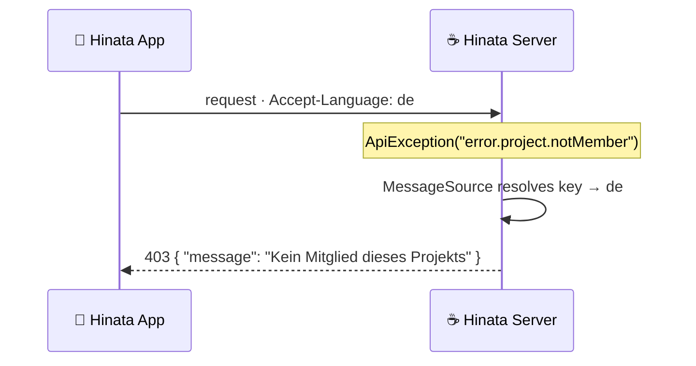
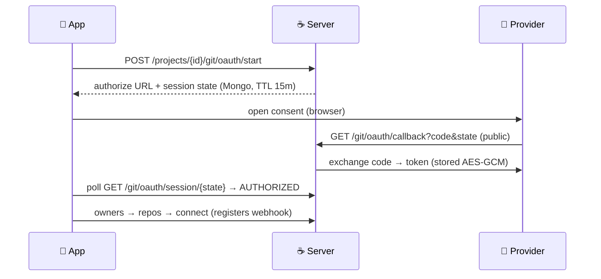

<!-- Logo -->
<p align="center">
  
</p>

<!-- Tagline -->
<p align="center">
  <b>Open-source, self-hosted project-management server — the backend of <a href="https://github.com/Ahmadre/Hinata">Hinata</a>.</b><br>
  <sub>Spring Boot 4 · Java 21 · MongoDB · no user, team or board limits, ever.</sub>
</p>

<!-- Badges -->
<p align="center">
  
  
  
  
  
</p>

<p align="center">
  <a href="#-features">Features</a> ·
  <a href="#-security">Security</a> ·
  <a href="#-quick-start-production">Quick start</a> ·
  <a href="#-local-development">Development</a> ·
  <a href="#-configuration">Configuration</a> ·
  <a href="#-api">API</a> ·
  <a href="#-git-integration">Git integration</a> ·
  <a href="#-license">License</a>
</p>

---

## ✨ Features

| Feature | Details |
| --- | --- |
| 📁 **Projects** | per-project workflows, issue numbering (`ASTA-42`), reusable project labels |
| 🐛 **Issues** | types, priorities, tags/labels, subtasks, dependencies, attachments (S3), comments |
| 📋 **Agile boards** | columns mapped to workflow states, WIP limits, backlog |
| 🏃 **Sprints** | plan / start / complete, capacity &amp; story points, burndown report |
| ⏱️ **Time tracking** | work items with activity types + weekly timesheets |
| 📈 **Gantt** | read model (start/due dates, dependencies, progress) |
| 📑 **Reports** | burndown, velocity, cycle time; state/priority/assignee distributions, created vs. resolved |
| 📊 **Dashboard** | today's tasks, completion, ranking, tracker |
| 📚 **Knowledge base** | hierarchical Markdown articles, global or per project |
| 📎 **Attachments** | S3/MinIO storage, presigned downloads, **live (SSE)** add/remove events |
| 🔔 **Notifications** | in-app + e-mail (SMTP), push-ready (FCM) |
| 📨 **E-mail → ticket** | IMAP polling turns inbound mail into issues |
| 🔑 **SSO** | OpenID Connect, OAuth 2.0, SAML 2.0, LDAP — configured at runtime |
| 🧙 **Setup wizard** | first-run flow, or fully automated via `HINATA_SETUP_*` |

---

## 🛡️ Security

> Hardened by default and mapped to the OWASP Top 10.

- 🔐 Stateless **JWT (HS512)** with short-lived access + refresh tokens; refresh tokens are rejected for API access
- 🔑 **BCrypt** (strength 12) password hashes, minimum 10-character passwords
- 🚧 Database-backed login blocking (survives restarts) + **bucket4j** rate limiting per client IP (strict budget on `/auth/**`)
- 🛂 Strict authorization by default; `/api/v1/admin/**` requires `ADMIN`
- 🧱 Hardened headers (HSTS, CSP, no-referrer), **localized** stable JSON errors without stack traces, regex-escaped search input
- 📎 Content-type &amp; size-validated uploads with randomized S3 object keys, presigned downloads
- 🙈 Secrets are write-only in the admin API (never echoed back)

---

## 🌍 Localized error messages

Error messages are resolved server-side from `messages.properties` (English,
default) and `messages_de.properties`, keyed off the client's `Accept-Language`
header — so a German client receives German errors without any hardcoded strings
in the app.



---

## 🚀 Quick start (production)

```bash
cp .env.example .env
./deploy/generate-secrets.sh   # creates Mongo keyfile + prints secrets for .env
docker compose up -d
```

This starts the server, a MongoDB **replica set (2 data nodes + 1 arbiter)**,
MinIO and Mailpit. Point the Hinata app at `HINATA_BASE_URL` and complete the
in-app setup wizard (or set `HINATA_SETUP_AUTO_COMPLETE=true`).

---

## 🛠️ Local development

```bash
docker compose -f docker-compose.dev.yml up -d   # Mongo RS, Mailpit, MinIO
HINATA_MONGODB_URI="mongodb://localhost:27017/hinata?replicaSet=rs0&directConnection=true" \
HINATA_S3_ACCESS_KEY=hinata HINATA_S3_SECRET_KEY=hinata-dev-secret \
./mvnw spring-boot:run
```

- 📬 Mailpit UI: <http://localhost:8025> · 🪣 MinIO console: <http://localhost:9001>
- ✅ Run tests: `./mvnw verify`

---

## ⚙️ Configuration

All settings are environment variables — see [.env.example](.env.example).
Runtime settings (SSO, e-mail ingest, push) live in MongoDB and are managed from
the app's admin area; changes apply **without restart**.

<details>
  <summary><b>📋 Environment variables</b></summary>

<br>

| Variable | Purpose |
| --- | --- |
| `HINATA_BASE_URL` | Public URL (JWT issuer, SSO redirects) |
| `HINATA_JWT_SECRET` | HS512 secret, ≥ 64 chars (required in production) |
| `HINATA_MONGODB_URI` | Mongo connection string |
| `HINATA_SMTP_*` | Outbound mail (Mailpit in dev) |
| `HINATA_S3_*` | S3-compatible storage (MinIO in dev) |
| `HINATA_APP_MIN_VERSION` | Force-update gate for the app |
| `HINATA_PRIVACY_POLICY_URL` | Privacy policy link served to the app |
| `HINATA_SETUP_*` | Optional non-interactive first-run setup |
| `HINATA_RATE_LIMIT_*` | Rate limiting &amp; brute-force thresholds |
| `HINATA_GIT_*` | Git integration OAuth apps, public API base &amp; token-encryption secret — see [Git integration](#-git-integration) |

</details>

---

## 🌐 API

REST under `/api/v1`. Public endpoints:

```text
/meta · /setup/status · /setup · /auth/login · /auth/refresh
/auth/sso/providers · /actuator/health
```

Everything else requires a bearer token. Attachment changes stream in real time
over **Server-Sent Events** at `/api/v1/issues/{issueId}/attachments/stream`.

---

## 🔗 Git integration

Connect each project to **one or more** repositories on **GitHub, GitLab or
Bitbucket** (e.g. an app + a server repo tracked by the same project).
The server brokers a real OAuth flow, registers a signed webhook, and turns
inbound push / pull-request / CI events into per-issue development info
(branches, commits, PR/MRs, build status) — plus **smart commits** and
**status automation**. Nothing is emulated: an event only lands when its
signature verifies against the secret stored when the repo was connected.

### Operator setup (one-time, platform-wide)

Register **one OAuth app per provider** and give the server its credentials —
either in the app's **Admin area → Git integration** (stored in Mongo, **DB
overrides env**, secrets write-only) or via environment. Both the OAuth callback
and the webhooks must be reachable from the provider, so set a **public API
base** (`HINATA_GIT_WEBHOOK_BASE_URL`, e.g. `https://<host>/api/v1`); it falls
back to `HINATA_BASE_URL` + `/api/v1`. Register this callback at each provider:

```text
<public-api-base>/git/oauth/callback
```

<details>
  <summary><b>📋 Git environment variables</b></summary>

<br>

| Variable | Purpose |
| --- | --- |
| `HINATA_GIT_GITHUB_CLIENT_ID` / `…_SECRET` | GitHub OAuth app credentials |
| `HINATA_GIT_GITLAB_CLIENT_ID` / `…_SECRET` | GitLab OAuth app credentials |
| `HINATA_GIT_BITBUCKET_CLIENT_ID` / `…_SECRET` | Bitbucket OAuth consumer credentials |
| `HINATA_GIT_WEBHOOK_BASE_URL` | Public API base for the OAuth callback **and** webhook registration |
| `HINATA_GIT_TOKEN_SECRET` | Key that AES-GCM-encrypts stored access tokens at rest (**change the default in production**) |

</details>

### OAuth flow (server-brokered)



Self-managed **GitHub Enterprise / GitLab / Bitbucket Data Center** skip OAuth:
`POST /projects/{id}/git/connect-token` with a repo URL + personal access token.

### Webhooks

On connect the server registers a hook (`push`, `create`, PR/MR, CI) pointing at
a **public**, signature-verified receiver, signed with a **per-project** secret:

| Provider | Endpoint | Verification |
| --- | --- | --- |
| **GitHub** | `POST /git/webhooks/github` | HMAC-SHA256 over the raw body (`X-Hub-Signature-256`) |
| **GitLab** | `POST /git/webhooks/gitlab` | token compare (`X-Gitlab-Token`) |
| **Bitbucket** | `POST /git/webhooks/bitbucket` | shared secret in the URL (`?secret=…`) |

The receiver finds the project by repo, verifies the secret, then maps the event
to any issue key (`ASTA-42`) found in the branch, commit message or PR title.

### Automation &amp; smart commits

Configured per project against **that project's** workflow states:

| Trigger | Rule |
| --- | --- |
| **Branch created** (`create` / `push` with a new ref) | move the issue (e.g. → *In Progress*) |
| **Commit pushed** to the **default** branch | move the issue |
| **PR/MR opened** | move the issue (e.g. → *In Review*) |
| **PR/MR merged** | move the issue (e.g. → *Done*) |

**Smart commits** — trailers in a commit message act on the referenced issue:
`ASTA-42 #comment shipped` adds a comment, `#time 2h 30m` logs work, and any
other `#word` transitions the issue.

> 🔒 Access tokens and per-connection webhook secrets are AES-GCM-encrypted at
> rest and never returned by the API. A project can connect **several** repos;
> automation rules + branch template are shared project-wide, while each repo
> keeps its own token, webhook and default branch. Only work pushed to a
> **connected** repo surfaces on the project's issues.

---

## 🔁 CI/CD

GitHub Actions ([.github/workflows/ci.yml](.github/workflows/ci.yml)) runs tests
on every push/PR and publishes the Docker image to **GHCR** on `main` and
version tags.

---

## 📄 License

**GPL-3.0** — see [LICENSE](LICENSE).

<p align="center"><sub>Made with 🍯 by Rebar Ahmad</sub></p>
